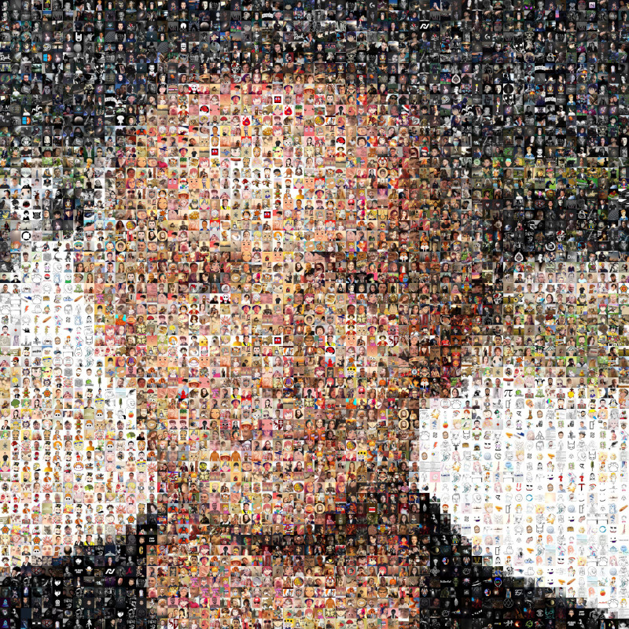

# TwitterMosaic

Création d'un mosaique d'une photo de profil d'un compte Twitter via ses followers/following

# Utilisation :
Telecharger les photos de profils Twitter qui vont composer la mosaique via le fichier "downloader.py"

Spécifier le nom d'utilisateur du compte dont vous voulez dessiner la mosaique, l'accès à l'API twitter, et executer le fichier.

Une fois fini configurer et executer "mosaic.py" qui va créer le rendu

# Demo
Avec le compte @SamuelEtienne

Avec Tirage unique :

